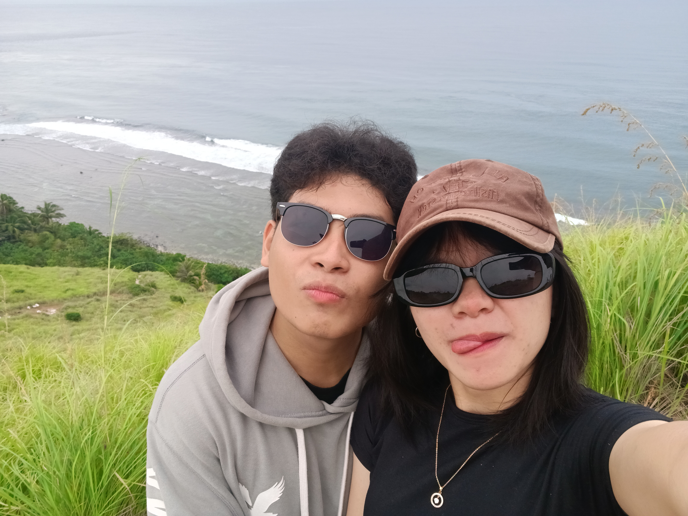
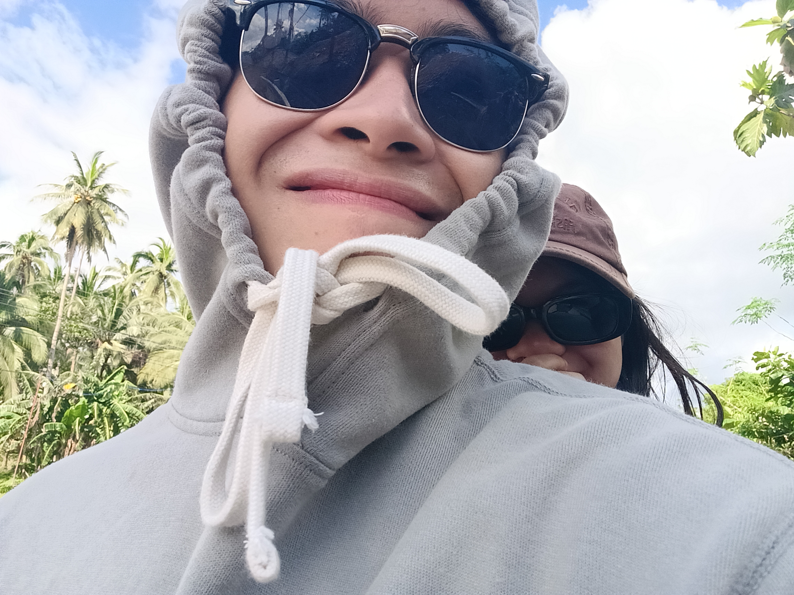

<head>
    <h1>📍About Me</h1>

<section>
        <strong>Hello I'm Chryz Marty! I enjoy exploring the world through photography, roadtrips, and reading.<strong/>

    </section>

<!DOCTYPE html>
<head>
    <h1>My Hobbies</h1>

</head>
<body>
    <h2>📷Photography</h2>
    
I love capturing the beauty of the world through my lens.

    
    
    

</head>
    <body>
    <h2>🛵Roadtrips</h2>
     
Good company in a journey makes the way seem shorter..

     
    
    </head>
      <body>
    <h2>📓Reading</h2>
     
A book is a garden, an orchard, a storehouse, a party, a company by the way, a counselor, a multitude of counselors

     
    
<!DOCTYPE html>
<html>
<head>
    <link rel="stylesheet" href="css/style.css">
</head>
<body>
   <h1>🪷Socials</h1>
   <a href="email.html">Facebook</a>
    <body>
    <a href="email.html">Instagram</a>
    <a href="email.html">Telegram</a>
 
